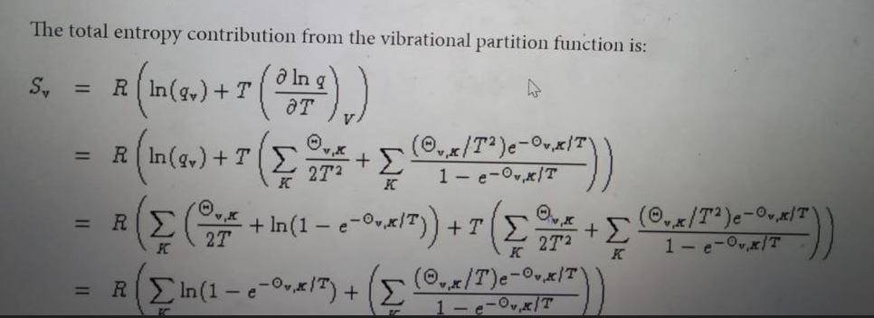

# Scaling Frequencies  
This is a code that enables us to scale frequencies, which is to change frequencies less than 50 to 50 or less than 100 to 100.
The general formula for scaling looks like this: 
ΔG_new = 〖ΔG〗_(old )– (ΔE_vib-TΔS_vib) _(γ<50 )+ (ΔE_vib-TΔS_vib) _(γ>50).
In this code we calculated vibrational entropy, vibrational energy and we calculated the new gibbs free energy of the reaction. Sv and Ev can be calculated using the partition equations which can be collected from gaussian.com site. Below is a screenshot of the formula for Sv.
  
There are some fixed parameters and constants that we also used their values from the given gaussian website. A great attention must be given to conversion units.
The bulk of the code focuses on getting the vibrational temperatures since as you can see in the formula there is no frequency however for each frequency there is an association of a vibrational temperature. By changing the frequencies less than 50 to 50 we have created a folder called changed50 that recalculated the vibrational temperature based on the formula (vibrational temperature =(h* freq)/k). 
The code starts by looping over the logfile, reading the lines, and saving each line of the file in a list called data using the function readlines. Then, we extract the frequencies by looping over the list data. This list data represents a list in which each element is a line of the given logfile. We gave it a condition that if it finds the term "Frequencies", then this is a line which is important to us and we want to save it in a list called line. Then we split this line list so that we get the frequencies.
Another important aspect of the code is to extract the vibrational temperatures. It is noticed that we have two blocks of Vibrational Temperatures, so to group them, we have created an empty list called starts and another empty list called ends. We defined starts as list that contain the line with Vibrational Temperature, and ends as line that contains "Zero-point corrections". 
Finally we applied the formulas.